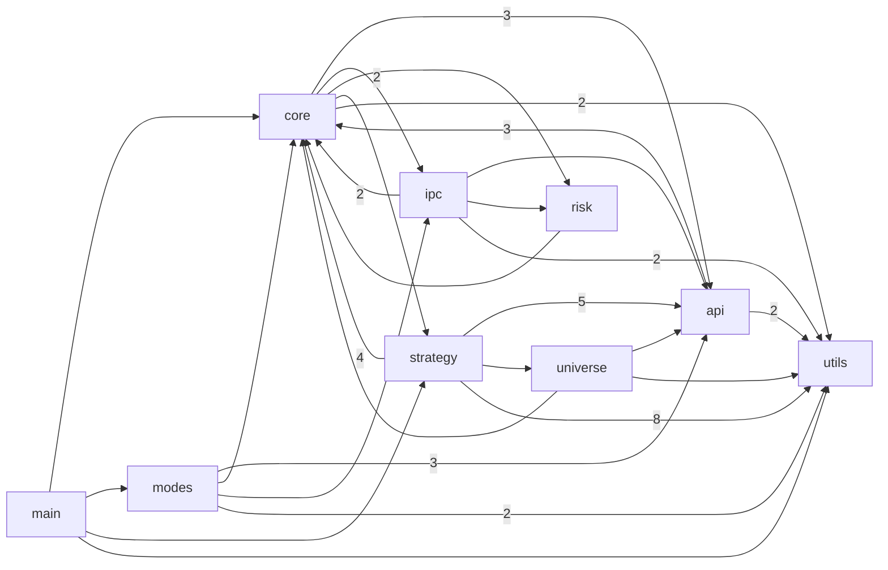

# 코드 의존 그래프 (Code Graph)

> 자동 생성물. 손편집 금지 — 코드가 바뀌면 `py scripts/gen_code_graph.py` 로 재생성한다.
> `Quant/include`·`Quant/src` 의 로컬 `#include "..."` 관계에서 뽑았다. 표준/외부 헤더는 제외.

## 모듈 의존 그래프

화살표 A→B 는 "모듈 A가 모듈 B의 헤더를 include 한다". 숫자는 그런 include 파일 쌍의 수(의존 강도).



## 공용 허브 헤더 (재빌드 팬아웃)

유입(누가 나를 include)이 많은 헤더. 한 줄만 바꿔도 아래 개수만큼 번역단위가 재컴파일된다.
증분빌드를 줄이려면 이 헤더를 얇게 유지한다(무거운 include를 전방선언/pimpl로 분리).

| 헤더 | 유입 수 |
|---|---|
| `utils/Logger.h` | 17 |
| `core/Types.h` | 13 |
| `api/KisClient.h` | 12 |
| `strategy/StrategyBase.h` | 11 |
| `ipc/ZmqBridge.h` | 4 |
| `api/KisWebSocket.h` | 3 |
| `core/Engine.h` | 3 |
| `risk/OrderGate.h` | 3 |

## 파일 단위 상세

각 소스/헤더가 어떤 로컬 헤더를 include 하는지. 유입이 많은 노드(`utils/Logger.h`·`core/Types.h`)가 공용 허브다.

```mermaid
graph LR
  subgraph api
    n_api_IOrderExecutor_h["api/IOrderExecutor.h"]
    n_api_KisClient_cpp["api/KisClient.cpp"]
    n_api_KisClient_h["api/KisClient.h"]
    n_api_KisWebSocket_h["api/KisWebSocket.h"]
    n_api_WebSocketClient_cpp["api/WebSocketClient.cpp"]
  end
  subgraph core
    n_core_Engine_cpp["core/Engine.cpp"]
    n_core_Engine_h["core/Engine.h"]
    n_core_RegimeController_cpp["core/RegimeController.cpp"]
    n_core_RegimeController_h["core/RegimeController.h"]
  end
  subgraph ipc
    n_ipc_OrderRouter_cpp["ipc/OrderRouter.cpp"]
    n_ipc_OrderRouter_h["ipc/OrderRouter.h"]
    n_ipc_ZmqBridge_cpp["ipc/ZmqBridge.cpp"]
    n_ipc_ZmqBridge_h["ipc/ZmqBridge.h"]
  end
  subgraph main
    n_main_cpp["main.cpp"]
  end
  subgraph modes
    n_modes_Monitors_cpp["modes/Monitors.cpp"]
    n_modes_Monitors_h["modes/Monitors.h"]
  end
  subgraph risk
    n_risk_OrderGate_cpp["risk/OrderGate.cpp"]
    n_risk_OrderGate_h["risk/OrderGate.h"]
  end
  subgraph strategy
    n_strategy_DeviationScaleStrategy_h["strategy/DeviationScaleStrategy.h"]
    n_strategy_FixedIntervalStrategy_h["strategy/FixedIntervalStrategy.h"]
    n_strategy_IntradayBreakoutStrategy_h["strategy/IntradayBreakoutStrategy.h"]
    n_strategy_MACrossStrategy_h["strategy/MACrossStrategy.h"]
    n_strategy_MarketMakingStrategy_h["strategy/MarketMakingStrategy.h"]
    n_strategy_MomentumStrategy_h["strategy/MomentumStrategy.h"]
    n_strategy_PriceTargetStrategy_h["strategy/PriceTargetStrategy.h"]
    n_strategy_StrategyBase_h["strategy/StrategyBase.h"]
    n_strategy_StrategyFactory_cpp["strategy/StrategyFactory.cpp"]
    n_strategy_StrategyFactory_h["strategy/StrategyFactory.h"]
    n_strategy_SupplyDemandPullbackStrategy_h["strategy/SupplyDemandPullbackStrategy.h"]
    n_strategy_ThemeStrategy_h["strategy/ThemeStrategy.h"]
    n_strategy_ValueContraryStrategy_h["strategy/ValueContraryStrategy.h"]
  end
  subgraph universe
    n_universe_UniverseScanner_cpp["universe/UniverseScanner.cpp"]
    n_universe_UniverseScanner_h["universe/UniverseScanner.h"]
  end
  n_api_IOrderExecutor_h --> n_core_Types_h
  n_api_KisClient_cpp --> n_api_KisClient_h
  n_api_KisClient_cpp --> n_utils_Logger_h
  n_api_KisClient_h --> n_api_IOrderExecutor_h
  n_api_KisClient_h --> n_core_Types_h
  n_api_KisWebSocket_h --> n_api_KisClient_h
  n_api_KisWebSocket_h --> n_core_Types_h
  n_api_WebSocketClient_cpp --> n_api_KisWebSocket_h
  n_api_WebSocketClient_cpp --> n_utils_Logger_h
  n_core_Engine_cpp --> n_core_Engine_h
  n_core_Engine_cpp --> n_utils_Logger_h
  n_core_Engine_h --> n_api_KisClient_h
  n_core_Engine_h --> n_api_KisWebSocket_h
  n_core_Engine_h --> n_core_RegimeController_h
  n_core_Engine_h --> n_core_RingBuffer_h
  n_core_Engine_h --> n_core_Types_h
  n_core_Engine_h --> n_ipc_OrderRouter_h
  n_core_Engine_h --> n_ipc_ZmqBridge_h
  n_core_Engine_h --> n_risk_OrderGate_h
  n_core_Engine_h --> n_strategy_StrategyBase_h
  n_core_RegimeController_cpp --> n_api_KisClient_h
  n_core_RegimeController_cpp --> n_core_RegimeController_h
  n_core_RegimeController_cpp --> n_utils_Logger_h
  n_core_RegimeController_h --> n_core_Types_h
  n_ipc_OrderRouter_cpp --> n_ipc_OrderRouter_h
  n_ipc_OrderRouter_cpp --> n_utils_Logger_h
  n_ipc_OrderRouter_h --> n_api_IOrderExecutor_h
  n_ipc_OrderRouter_h --> n_core_Types_h
  n_ipc_OrderRouter_h --> n_ipc_ZmqBridge_h
  n_ipc_OrderRouter_h --> n_risk_OrderGate_h
  n_ipc_ZmqBridge_cpp --> n_ipc_ZmqBridge_h
  n_ipc_ZmqBridge_cpp --> n_utils_Logger_h
  n_ipc_ZmqBridge_h --> n_core_Types_h
  n_main_cpp --> n_core_Engine_h
  n_main_cpp --> n_modes_Monitors_h
  n_main_cpp --> n_strategy_StrategyFactory_h
  n_main_cpp --> n_utils_Logger_h
  n_modes_Monitors_cpp --> n_api_KisClient_h
  n_modes_Monitors_cpp --> n_api_KisWebSocket_h
  n_modes_Monitors_cpp --> n_core_Types_h
  n_modes_Monitors_cpp --> n_ipc_ZmqBridge_h
  n_modes_Monitors_cpp --> n_modes_Monitors_h
  n_modes_Monitors_cpp --> n_utils_Logger_h
  n_modes_Monitors_cpp --> n_utils_Utf8_h
  n_modes_Monitors_h --> n_api_KisClient_h
  n_risk_OrderGate_cpp --> n_risk_OrderGate_h
  n_risk_OrderGate_h --> n_core_Types_h
  n_strategy_DeviationScaleStrategy_h --> n_api_KisClient_h
  n_strategy_DeviationScaleStrategy_h --> n_strategy_StrategyBase_h
  n_strategy_DeviationScaleStrategy_h --> n_utils_Logger_h
  n_strategy_FixedIntervalStrategy_h --> n_strategy_StrategyBase_h
  n_strategy_FixedIntervalStrategy_h --> n_utils_Logger_h
  n_strategy_IntradayBreakoutStrategy_h --> n_strategy_StrategyBase_h
  n_strategy_IntradayBreakoutStrategy_h --> n_utils_Logger_h
  n_strategy_MACrossStrategy_h --> n_strategy_StrategyBase_h
  n_strategy_MarketMakingStrategy_h --> n_strategy_StrategyBase_h
  n_strategy_MomentumStrategy_h --> n_strategy_StrategyBase_h
  n_strategy_PriceTargetStrategy_h --> n_strategy_StrategyBase_h
  n_strategy_PriceTargetStrategy_h --> n_utils_Logger_h
  n_strategy_StrategyBase_h --> n_core_Types_h
  n_strategy_StrategyFactory_cpp --> n_core_Engine_h
  n_strategy_StrategyFactory_cpp --> n_core_Types_h
  n_strategy_StrategyFactory_cpp --> n_strategy_DeviationScaleStrategy_h
  n_strategy_StrategyFactory_cpp --> n_strategy_FixedIntervalStrategy_h
  n_strategy_StrategyFactory_cpp --> n_strategy_IntradayBreakoutStrategy_h
  n_strategy_StrategyFactory_cpp --> n_strategy_MACrossStrategy_h
  n_strategy_StrategyFactory_cpp --> n_strategy_MarketMakingStrategy_h
  n_strategy_StrategyFactory_cpp --> n_strategy_MomentumStrategy_h
  n_strategy_StrategyFactory_cpp --> n_strategy_PriceTargetStrategy_h
  n_strategy_StrategyFactory_cpp --> n_strategy_StrategyFactory_h
  n_strategy_StrategyFactory_cpp --> n_strategy_SupplyDemandPullbackStrategy_h
  n_strategy_StrategyFactory_cpp --> n_strategy_ThemeStrategy_h
  n_strategy_StrategyFactory_cpp --> n_strategy_ValueContraryStrategy_h
  n_strategy_StrategyFactory_cpp --> n_universe_UniverseScanner_h
  n_strategy_StrategyFactory_cpp --> n_utils_Logger_h
  n_strategy_StrategyFactory_h --> n_api_KisClient_h
  n_strategy_SupplyDemandPullbackStrategy_h --> n_api_KisClient_h
  n_strategy_SupplyDemandPullbackStrategy_h --> n_core_Types_h
  n_strategy_SupplyDemandPullbackStrategy_h --> n_strategy_StrategyBase_h
  n_strategy_SupplyDemandPullbackStrategy_h --> n_utils_Logger_h
  n_strategy_ThemeStrategy_h --> n_api_KisClient_h
  n_strategy_ThemeStrategy_h --> n_strategy_StrategyBase_h
  n_strategy_ThemeStrategy_h --> n_utils_Logger_h
  n_strategy_ValueContraryStrategy_h --> n_api_KisClient_h
  n_strategy_ValueContraryStrategy_h --> n_strategy_StrategyBase_h
  n_strategy_ValueContraryStrategy_h --> n_utils_Logger_h
  n_universe_UniverseScanner_cpp --> n_core_Types_h
  n_universe_UniverseScanner_cpp --> n_universe_UniverseScanner_h
  n_universe_UniverseScanner_cpp --> n_utils_Logger_h
  n_universe_UniverseScanner_h --> n_api_KisClient_h
```



## 영향범위 질의 · 기계 소비

편집·커밋 전 영향범위(재검증/재빌드 대상)를 파일 열지 않고 뽑는다:

```bash
py scripts/gen_code_graph.py --impact core/Types.h
py scripts/gen_code_graph.py --json   # docs/code_graph.json
```

`docs/code_graph.dot` 도 생성했다(Graphviz 설치 시 `dot -Tsvg docs/code_graph.dot -o docs/code_graph.svg`).

