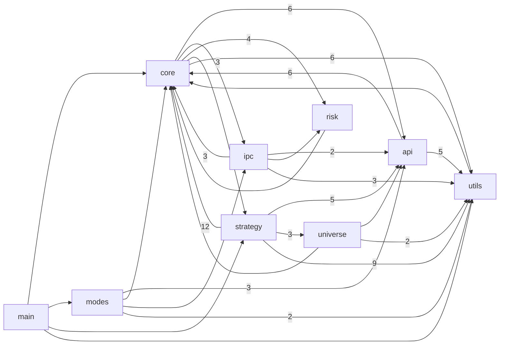
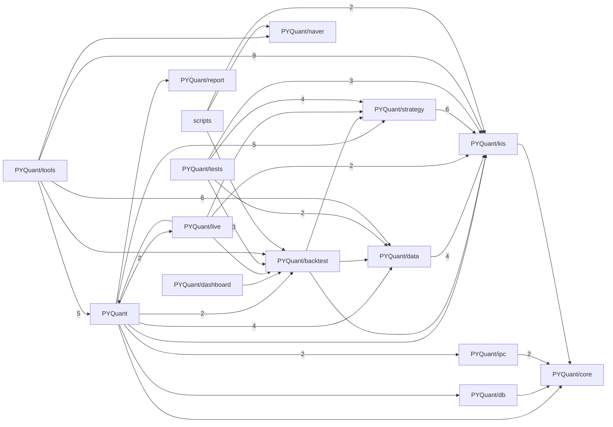

# 코드 의존 그래프 (Code Graph)

> 자동 생성물. 손편집 금지 — 코드가 바뀌면 `py scripts/gen_code_graph.py` 로 재생성한다.
> `Quant/include`·`Quant/src` 의 로컬 `#include "..."` 관계에서 뽑았다. 표준/외부 헤더는 제외.

## 모듈 의존 그래프

화살표 A→B 는 "모듈 A가 모듈 B의 헤더를 include 한다". 숫자는 그런 include 파일 쌍의 수(의존 강도).



## 공용 허브 헤더 (재빌드 팬아웃)

유입(누가 나를 include)이 많은 헤더. 한 줄만 바꿔도 아래 개수만큼 번역단위가 재컴파일된다.
증분빌드를 줄이려면 이 헤더를 얇게 유지한다(무거운 include를 전방선언/pimpl로 분리).

| 헤더 | 유입 수 |
|---|---|
| `utils/Logger.h` | 25 |
| `core/Types.h` | 21 |
| `api/KisClient.h` | 11 |
| `strategy/StrategyBase.h` | 11 |
| `risk/OrderGate.h` | 5 |
| `core/MarketSession.h` | 4 |
| `ipc/ZmqBridge.h` | 4 |
| `api/KisErrorCodes.h` | 3 |

## 파일 단위 상세

각 소스/헤더가 어떤 로컬 헤더를 include 하는지. 유입이 많은 노드(`utils/Logger.h`·`core/Types.h`)가 공용 허브다.

```mermaid
graph LR
  subgraph api
    n_api_IMarketDataSource_h["api/IMarketDataSource.h"]
    n_api_IOrderExecutor_h["api/IOrderExecutor.h"]
    n_api_KisAccount_cpp["api/KisAccount.cpp"]
    n_api_KisClient_h["api/KisClient.h"]
    n_api_KisClientInternal_h["api/KisClientInternal.h"]
    n_api_KisIndex_cpp["api/KisIndex.cpp"]
    n_api_KisMarket_cpp["api/KisMarket.cpp"]
    n_api_KisRestDecode_h["api/KisRestDecode.h"]
    n_api_KisWebSocket_h["api/KisWebSocket.h"]
    n_api_KisWsDecode_h["api/KisWsDecode.h"]
    n_api_WebSocketClient_cpp["api/WebSocketClient.cpp"]
    n_api_WsSocketPosix_cpp["api/WsSocketPosix.cpp"]
    n_api_WsSocketWin_cpp["api/WsSocketWin.cpp"]
  end
  subgraph core
    n_core_BarAggregator_cpp["core/BarAggregator.cpp"]
    n_core_BarAggregator_h["core/BarAggregator.h"]
    n_core_DataPoller_cpp["core/DataPoller.cpp"]
    n_core_DataPoller_h["core/DataPoller.h"]
    n_core_Engine_cpp["core/Engine.cpp"]
    n_core_Engine_h["core/Engine.h"]
    n_core_LedgerReconciler_cpp["core/LedgerReconciler.cpp"]
    n_core_LedgerReconciler_h["core/LedgerReconciler.h"]
    n_core_OrderPacer_cpp["core/OrderPacer.cpp"]
    n_core_OrderPacer_h["core/OrderPacer.h"]
    n_core_RegimeController_cpp["core/RegimeController.cpp"]
    n_core_RegimeController_h["core/RegimeController.h"]
    n_core_SignalDispatcher_cpp["core/SignalDispatcher.cpp"]
    n_core_SignalDispatcher_h["core/SignalDispatcher.h"]
    n_core_TickSize_h["core/TickSize.h"]
  end
  subgraph ipc
    n_ipc_OpsServer_cpp["ipc/OpsServer.cpp"]
    n_ipc_OpsServer_h["ipc/OpsServer.h"]
    n_ipc_OrderRouter_cpp["ipc/OrderRouter.cpp"]
    n_ipc_OrderRouter_h["ipc/OrderRouter.h"]
    n_ipc_ZmqBridge_cpp["ipc/ZmqBridge.cpp"]
    n_ipc_ZmqBridge_h["ipc/ZmqBridge.h"]
  end
  subgraph main
    n_main_cpp["main.cpp"]
  end
  subgraph modes
    n_modes_Monitors_cpp["modes/Monitors.cpp"]
    n_modes_Monitors_h["modes/Monitors.h"]
  end
  subgraph risk
    n_risk_OrderGate_cpp["risk/OrderGate.cpp"]
    n_risk_OrderGate_h["risk/OrderGate.h"]
  end
  subgraph strategy
    n_strategy_DeviationScaleStrategy_h["strategy/DeviationScaleStrategy.h"]
    n_strategy_FixedIntervalStrategy_h["strategy/FixedIntervalStrategy.h"]
    n_strategy_IntradayBreakoutStrategy_h["strategy/IntradayBreakoutStrategy.h"]
    n_strategy_MACrossStrategy_h["strategy/MACrossStrategy.h"]
    n_strategy_MarketMakingStrategy_h["strategy/MarketMakingStrategy.h"]
    n_strategy_MomentumStrategy_h["strategy/MomentumStrategy.h"]
    n_strategy_PriceTargetStrategy_h["strategy/PriceTargetStrategy.h"]
    n_strategy_SeedPeakStore_h["strategy/SeedPeakStore.h"]
    n_strategy_StrategyBase_h["strategy/StrategyBase.h"]
    n_strategy_StrategyFactory_cpp["strategy/StrategyFactory.cpp"]
    n_strategy_StrategyFactory_h["strategy/StrategyFactory.h"]
    n_strategy_SupplyDemandPullbackStrategy_h["strategy/SupplyDemandPullbackStrategy.h"]
    n_strategy_ThemeStrategy_h["strategy/ThemeStrategy.h"]
    n_strategy_ValueContraryStrategy_h["strategy/ValueContraryStrategy.h"]
  end
  subgraph universe
    n_universe_UniverseScanner_cpp["universe/UniverseScanner.cpp"]
    n_universe_UniverseScanner_h["universe/UniverseScanner.h"]
  end
  subgraph utils
    n_utils_Logger_h["utils/Logger.h"]
  end
  n_api_IMarketDataSource_h --> n_core_Types_h
  n_api_IOrderExecutor_h --> n_core_Types_h
  n_api_KisAccount_cpp --> n_api_KisRestDecode_h
  n_api_KisClient_h --> n_api_IMarketDataSource_h
  n_api_KisClient_h --> n_api_IOrderExecutor_h
  n_api_KisClient_h --> n_api_KisResult_h
  n_api_KisClient_h --> n_api_KisTypes_h
  n_api_KisClient_h --> n_core_Types_h
  n_api_KisClientInternal_h --> n_api_KisClient_h
  n_api_KisClientInternal_h --> n_api_KisErrorCodes_h
  n_api_KisClientInternal_h --> n_utils_EtfFilter_h
  n_api_KisClientInternal_h --> n_utils_Logger_h
  n_api_KisIndex_cpp --> n_api_KisRestDecode_h
  n_api_KisMarket_cpp --> n_api_KisRestDecode_h
  n_api_KisRestDecode_h --> n_api_KisTypes_h
  n_api_KisRestDecode_h --> n_core_Types_h
  n_api_KisWebSocket_h --> n_api_KisClient_h
  n_api_KisWebSocket_h --> n_api_KisWsDecode_h
  n_api_KisWebSocket_h --> n_core_Types_h
  n_api_KisWsDecode_h --> n_core_Types_h
  n_api_WebSocketClient_cpp --> n_api_KisWebSocket_h
  n_api_WebSocketClient_cpp --> n_api_KisWsDecode_h
  n_api_WebSocketClient_cpp --> n_utils_Logger_h
  n_api_WsSocketPosix_cpp --> n_utils_Logger_h
  n_api_WsSocketWin_cpp --> n_utils_Logger_h
  n_core_BarAggregator_cpp --> n_core_BarAggregator_h
  n_core_BarAggregator_cpp --> n_core_KstTime_h
  n_core_BarAggregator_h --> n_core_Types_h
  n_core_DataPoller_cpp --> n_core_DataPoller_h
  n_core_DataPoller_cpp --> n_core_KstTime_h
  n_core_DataPoller_cpp --> n_utils_Logger_h
  n_core_DataPoller_h --> n_core_Types_h
  n_core_Engine_cpp --> n_core_Engine_h
  n_core_Engine_cpp --> n_core_ReconcilePlan_h
  n_core_Engine_cpp --> n_utils_Logger_h
  n_core_Engine_h --> n_api_KisClient_h
  n_core_Engine_h --> n_api_KisWebSocket_h
  n_core_Engine_h --> n_core_DataPoller_h
  n_core_Engine_h --> n_core_LedgerReconciler_h
  n_core_Engine_h --> n_core_MpscQueue_h
  n_core_Engine_h --> n_core_OrderPacer_h
  n_core_Engine_h --> n_core_RegimeController_h
  n_core_Engine_h --> n_core_RegimeFileBridge_h
  n_core_Engine_h --> n_core_RingBuffer_h
  n_core_Engine_h --> n_core_SignalDispatcher_h
  n_core_Engine_h --> n_core_Types_h
  n_core_Engine_h --> n_ipc_OpsServer_h
  n_core_Engine_h --> n_ipc_OrderRouter_h
  n_core_Engine_h --> n_ipc_ZmqBridge_h
  n_core_Engine_h --> n_risk_OrderGate_h
  n_core_Engine_h --> n_strategy_StrategyBase_h
  n_core_LedgerReconciler_cpp --> n_core_LedgerReconciler_h
  n_core_LedgerReconciler_cpp --> n_utils_Logger_h
  n_core_LedgerReconciler_h --> n_api_KisResult_h
  n_core_LedgerReconciler_h --> n_api_KisTypes_h
  n_core_LedgerReconciler_h --> n_core_KstTime_h
  n_core_LedgerReconciler_h --> n_core_ReconcilePlan_h
  n_core_LedgerReconciler_h --> n_risk_OrderGate_h
  n_core_OrderPacer_cpp --> n_api_KisErrorCodes_h
  n_core_OrderPacer_cpp --> n_core_OrderPacer_h
  n_core_OrderPacer_cpp --> n_risk_GateReasons_h
  n_core_OrderPacer_cpp --> n_utils_Logger_h
  n_core_OrderPacer_h --> n_core_Types_h
  n_core_RegimeController_cpp --> n_api_IMarketDataSource_h
  n_core_RegimeController_cpp --> n_core_RegimeController_h
  n_core_RegimeController_cpp --> n_utils_Logger_h
  n_core_RegimeController_h --> n_core_Types_h
  n_core_SignalDispatcher_cpp --> n_core_SignalDispatcher_h
  n_core_SignalDispatcher_cpp --> n_utils_Logger_h
  n_core_SignalDispatcher_h --> n_core_Types_h
  n_core_SignalDispatcher_h --> n_risk_OrderGate_h
  n_core_TickSize_h --> n_core_Types_h
  n_ipc_OpsServer_cpp --> n_ipc_OpsServer_h
  n_ipc_OpsServer_cpp --> n_utils_Logger_h
  n_ipc_OpsServer_h --> n_ipc_OpsProtocol_h
  n_ipc_OrderRouter_cpp --> n_api_KisErrorCodes_h
  n_ipc_OrderRouter_cpp --> n_ipc_OrderRouter_h
  n_ipc_OrderRouter_cpp --> n_utils_Logger_h
  n_ipc_OrderRouter_h --> n_api_IOrderExecutor_h
  n_ipc_OrderRouter_h --> n_core_ReconcilePlan_h
  n_ipc_OrderRouter_h --> n_core_Types_h
  n_ipc_OrderRouter_h --> n_ipc_ZmqBridge_h
  n_ipc_OrderRouter_h --> n_risk_OrderGate_h
  n_ipc_ZmqBridge_cpp --> n_ipc_ZmqBridge_h
  n_ipc_ZmqBridge_cpp --> n_utils_Logger_h
  n_ipc_ZmqBridge_h --> n_core_Types_h
  n_main_cpp --> n_core_Engine_h
  n_main_cpp --> n_modes_Monitors_h
  n_main_cpp --> n_strategy_StrategyFactory_h
  n_main_cpp --> n_utils_Logger_h
  n_modes_Monitors_cpp --> n_api_KisClient_h
  n_modes_Monitors_cpp --> n_api_KisWebSocket_h
  n_modes_Monitors_cpp --> n_core_Types_h
  n_modes_Monitors_cpp --> n_ipc_ZmqBridge_h
  n_modes_Monitors_cpp --> n_modes_Monitors_h
  n_modes_Monitors_cpp --> n_utils_Logger_h
  n_modes_Monitors_cpp --> n_utils_Utf8_h
  n_modes_Monitors_h --> n_api_KisClient_h
  n_risk_OrderGate_cpp --> n_risk_GateReasons_h
  n_risk_OrderGate_cpp --> n_risk_OrderGate_h
  n_risk_OrderGate_h --> n_core_Types_h
  n_strategy_DeviationScaleStrategy_h --> n_api_KisClient_h
  n_strategy_DeviationScaleStrategy_h --> n_core_BarAggregator_h
  n_strategy_DeviationScaleStrategy_h --> n_core_DataPoller_h
  n_strategy_DeviationScaleStrategy_h --> n_core_TickSize_h
  n_strategy_DeviationScaleStrategy_h --> n_strategy_StrategyBase_h
  n_strategy_DeviationScaleStrategy_h --> n_universe_MaAlign_h
  n_strategy_DeviationScaleStrategy_h --> n_utils_Logger_h
  n_strategy_FixedIntervalStrategy_h --> n_core_MarketSession_h
  n_strategy_FixedIntervalStrategy_h --> n_strategy_StrategyBase_h
  n_strategy_FixedIntervalStrategy_h --> n_utils_Logger_h
  n_strategy_IntradayBreakoutStrategy_h --> n_strategy_SeedPeakStore_h
  n_strategy_IntradayBreakoutStrategy_h --> n_strategy_StrategyBase_h
  n_strategy_IntradayBreakoutStrategy_h --> n_utils_Logger_h
  n_strategy_MACrossStrategy_h --> n_strategy_StrategyBase_h
  n_strategy_MarketMakingStrategy_h --> n_core_TickSize_h
  n_strategy_MarketMakingStrategy_h --> n_strategy_StrategyBase_h
  n_strategy_MomentumStrategy_h --> n_strategy_StrategyBase_h
  n_strategy_PriceTargetStrategy_h --> n_core_MarketSession_h
  n_strategy_PriceTargetStrategy_h --> n_strategy_StrategyBase_h
  n_strategy_PriceTargetStrategy_h --> n_utils_Logger_h
  n_strategy_SeedPeakStore_h --> n_utils_Logger_h
  n_strategy_StrategyBase_h --> n_core_Types_h
  n_strategy_StrategyFactory_cpp --> n_core_Engine_h
  n_strategy_StrategyFactory_cpp --> n_core_Types_h
  n_strategy_StrategyFactory_cpp --> n_strategy_DeviationScaleStrategy_h
  n_strategy_StrategyFactory_cpp --> n_strategy_FixedIntervalStrategy_h
  n_strategy_StrategyFactory_cpp --> n_strategy_IntradayBreakoutStrategy_h
  n_strategy_StrategyFactory_cpp --> n_strategy_MACrossStrategy_h
  n_strategy_StrategyFactory_cpp --> n_strategy_MarketMakingStrategy_h
  n_strategy_StrategyFactory_cpp --> n_strategy_MomentumStrategy_h
  n_strategy_StrategyFactory_cpp --> n_strategy_PriceTargetStrategy_h
  n_strategy_StrategyFactory_cpp --> n_strategy_StrategyFactory_h
  n_strategy_StrategyFactory_cpp --> n_strategy_SupplyDemandPullbackStrategy_h
  n_strategy_StrategyFactory_cpp --> n_strategy_ThemeStrategy_h
  n_strategy_StrategyFactory_cpp --> n_strategy_ValueContraryStrategy_h
  n_strategy_StrategyFactory_cpp --> n_universe_ScoreWeight_h
  n_strategy_StrategyFactory_cpp --> n_universe_UniverseScanner_h
  n_strategy_StrategyFactory_cpp --> n_utils_Logger_h
  n_strategy_StrategyFactory_h --> n_api_KisClient_h
  n_strategy_SupplyDemandPullbackStrategy_h --> n_api_KisClient_h
  n_strategy_SupplyDemandPullbackStrategy_h --> n_core_Types_h
  n_strategy_SupplyDemandPullbackStrategy_h --> n_strategy_StrategyBase_h
  n_strategy_SupplyDemandPullbackStrategy_h --> n_utils_Logger_h
  n_strategy_ThemeStrategy_h --> n_api_KisClient_h
  n_strategy_ThemeStrategy_h --> n_core_MarketSession_h
  n_strategy_ThemeStrategy_h --> n_strategy_StrategyBase_h
  n_strategy_ThemeStrategy_h --> n_utils_Logger_h
  n_strategy_ValueContraryStrategy_h --> n_api_KisClient_h
  n_strategy_ValueContraryStrategy_h --> n_core_MarketSession_h
  n_strategy_ValueContraryStrategy_h --> n_strategy_StrategyBase_h
  n_strategy_ValueContraryStrategy_h --> n_utils_Logger_h
  n_universe_UniverseScanner_cpp --> n_core_Types_h
  n_universe_UniverseScanner_cpp --> n_universe_MaAlign_h
  n_universe_UniverseScanner_cpp --> n_universe_UniverseScanner_h
  n_universe_UniverseScanner_cpp --> n_utils_EtfFilter_h
  n_universe_UniverseScanner_cpp --> n_utils_Logger_h
  n_universe_UniverseScanner_h --> n_api_KisClient_h
  n_utils_Logger_h --> n_core_MpscQueue_h
```



## Python import 그래프

`PYQuant/**`·`scripts/*.py` 의 내부 import만(표준·서드파티 제외). 화살표는 패키지 단위, 숫자는 파일 쌍 수.



| 파일 | 내부 import |
|---|---|
| `PYQuant/backtest/devscale_replay.py` | `backtest.engine` |
| `PYQuant/backtest/engine.py` | `data.index_source`, `kis.client`, `strategy.base` |
| `PYQuant/backtest/report.py` | `backtest.engine` |
| `PYQuant/dashboard/backfill_series_a.py` | `backtest.report` |
| `PYQuant/data/datagokr_source.py` | `kis.client` |
| `PYQuant/data/index_source.py` | `kis.client` |
| `PYQuant/data/krx_source.py` | `kis.client` |
| `PYQuant/data/universe_kospi.py` | `data.krx_source` |
| `PYQuant/data/yfinance_source.py` | `data.universe_kospi`, `kis.client` |
| `PYQuant/db/client.py` | `core.logger` |
| `PYQuant/ipc/operator.py` | `core.logger` |
| `PYQuant/ipc/subscriber.py` | `core.logger` |
| `PYQuant/kis/client.py` | `core.logger` |
| `PYQuant/live/forward_trader.py` | `backtest.engine`, `kis.client`, `main` |
| `PYQuant/live/trader.py` | `kis.client`, `strategy.base` |
| `PYQuant/main.py` | `backtest.engine`, `backtest.report`, `core.logger`, `data.datagokr_source`, `data.krx_source`, `data.universe_kospi`, `data.yfinance_source`, `db.client`, `ipc.operator`, `ipc.subscriber`, `kis.client`, `live.forward_trader`, `live.trader`, `report.account`, `strategy.cross_momentum`, `strategy.mean_reversion`, `strategy.strategy_a`, `strategy.supply_demand_rank`, `strategy.value_contrary` |
| `PYQuant/strategy/base.py` | `kis.client` |
| `PYQuant/strategy/cross_momentum.py` | `kis.client`, `strategy.base` |
| `PYQuant/strategy/donchian_breakout.py` | `strategy.base` |
| `PYQuant/strategy/indicators.py` | `kis.client` |
| `PYQuant/strategy/mean_reversion.py` | `strategy.base`, `strategy.indicators` |
| `PYQuant/strategy/strategy_a.py` | `kis.client`, `strategy.base`, `strategy.indicators` |
| `PYQuant/strategy/supply_demand_rank.py` | `kis.client`, `strategy.base` |
| `PYQuant/strategy/value_contrary.py` | `kis.client`, `strategy.base` |
| `PYQuant/tests/test_adjust_splits.py` | `data.datagokr_source` |
| `PYQuant/tests/test_backtest_engine.py` | `backtest.engine`, `data.krx_source`, `kis.client`, `strategy.supply_demand_rank`, `strategy.value_contrary` |
| `PYQuant/tests/test_indicators.py` | `kis.client`, `strategy.indicators` |
| `PYQuant/tests/test_metrics.py` | `backtest.metrics` |
| `PYQuant/tests/test_regime_scorer.py` | `backtest.regime_scorer` |
| `PYQuant/tests/test_strategy_a.py` | `kis.client`, `strategy.strategy_a` |
| `PYQuant/tools/ablation_2022.py` | `main` |
| `PYQuant/tools/check_investor_api.py` | `kis.client` |
| `PYQuant/tools/check_market_flow.py` | `kis.client` |
| `PYQuant/tools/check_sector_index.py` | `kis.client` |
| `PYQuant/tools/fetch_naver_themes.py` | `naver.theme` |
| `PYQuant/tools/full_universe_dump.py` | `data.datagokr_source` |
| `PYQuant/tools/fullperiod_validate.py` | `data.datagokr_source`, `main`, `tools.month_start_sweep` |
| `PYQuant/tools/index_intraday_logger.py` | `kis.client` |
| `PYQuant/tools/investor_flow_logger.py` | `kis.client` |
| `PYQuant/tools/minute_backfill.py` | `kis.client` |
| `PYQuant/tools/month_start_sweep.py` | `data.datagokr_source`, `main` |
| `PYQuant/tools/nxt_divergence_probe.py` | `kis.client` |
| `PYQuant/tools/pit_universe_backfill.py` | `kis.client`, `tools.universe_feed` |
| `PYQuant/tools/probe_adjusted.py` | `data.datagokr_source` |
| `PYQuant/tools/probe_datagokr.py` | `data.datagokr_source` |
| `PYQuant/tools/probe_kis_investor.py` | `kis.client` |
| `PYQuant/tools/sweep.py` | `main` |
| `PYQuant/tools/universe_feed.py` | `data.datagokr_source` |
| `PYQuant/tools/walkforward.py` | `backtest.engine`, `main` |
| `scripts/analyze_slot_cost.py` | `_logdir` |
| `scripts/backfill_studies.py` | `backtest.report` |
| `scripts/build_review_entry.py` | `eod_collect` |
| `scripts/check_runtime_health.py` | `_logdir`, `log_patterns` |
| `scripts/dashboard_server.py` | `_logdir`, `kis.client`, `naver.theme` |
| `scripts/eod_autodoc.py` | `_logdir`, `log_patterns` |
| `scripts/eod_collect.py` | `_logdir`, `log_patterns` |
| `scripts/notify_sidecar.py` | `_logdir`, `dashboard_server`, `kis.client`, `log_patterns` |
| `scripts/parse_quant_log.py` | `_logdir` |
| `scripts/summarize_trading_day.py` | `_logdir`, `log_patterns` |

## 프로세스 경계 파일

C++ 엔진·Python 보조 프로세스·스크립트가 파일로 주고받는 지점. 코드의 문자열 리터럴에서 찾았고,
읽기/쓰기는 리터럴 주변 줄의 힌트(ofstream·dump·read_text 등)로 분류했다. 힌트가 없으면 '언급만'.

| 파일 | 쓰는 쪽 | 읽는 쪽 | 언급만 |
|---|---|---|---|
| `regime.json` | `PYQuant/tools/macro_regime_feed.py` | `PYQuant/tools/macro_regime_feed.py`, `Quant/src/core/Engine.cpp`, `scripts/dashboard_server.py`, `scripts/notify_sidecar.py` | `Quant/include/core/Engine.h`, `Quant/src/main.cpp` |
| `prices_live.json` | `scripts/live_prices_feed.py` | `scripts/live_prices_feed.py` |  |
| `trades_*.csv` | `Quant/src/ipc/OrderRouter.cpp` | `PYQuant/dashboard/backfill_live.py`, `Quant/src/ipc/OrderRouter.cpp`, `scripts/parse_quant_log.py` | `scripts/_logdir.py`, `scripts/notify_sidecar.py` |
| `universe*.json` |  | `PYQuant/main.py`, `PYQuant/tools/full_universe_dump.py`, `PYQuant/tools/nxt_divergence_probe.py`, `PYQuant/tools/universe_feed.py`, `Quant/src/universe/UniverseScanner.cpp`, `scripts/eod_minute_backfill.py`, `scripts/live_prices_feed.py`, `scripts/notify_sidecar.py` | `Quant/include/universe/UniverseScanner.h`, `Quant/src/api/KisUniverse.cpp`, `Quant/src/strategy/StrategyFactory.cpp`, `scripts/dashboard_server.py` |
| `open_orders.txt` | `Quant/src/ipc/OrderRouter.cpp`, `scripts/seed_open_orders.py` | `Quant/src/ipc/OrderRouter.cpp`, `scripts/seed_open_orders.py` |  |
| `quant_trader.log` | `PYQuant/tools/log_report.py`, `scripts/build_review_entry.py`, `scripts/summarize_trading_day.py` | `scripts/_logdir.py`, `scripts/check_runtime_health.py`, `scripts/dashboard_server.py`, `scripts/eod_autodoc.py`, `scripts/eod_collect.py`, `scripts/extract_swap_counterfactual.py`, `scripts/notify_sidecar.py`, `scripts/parse_quant_log.py`, `scripts/seed_open_orders.py`, `scripts/summarize_trading_day.py` | `Quant/src/main.cpp` |
| `kis_token_*.json` |  | `scripts/gen_facts.py` | `PYQuant/kis/client.py`, `Quant/src/api/KisAuth.cpp` |

## 영향범위 질의 · 기계 소비

편집·커밋 전 영향범위(재검증/재빌드 대상)를 파일 열지 않고 뽑는다:

```bash
py scripts/gen_code_graph.py --impact core/Types.h
py scripts/gen_code_graph.py --json   # docs/code_graph.json
```

`docs/code_graph.dot` 도 생성했다. Graphviz가 있으면 SVG로 렌더할 수 있다.

```bash
dot -Tsvg docs/code_graph.dot -o docs/code_graph.svg
```

