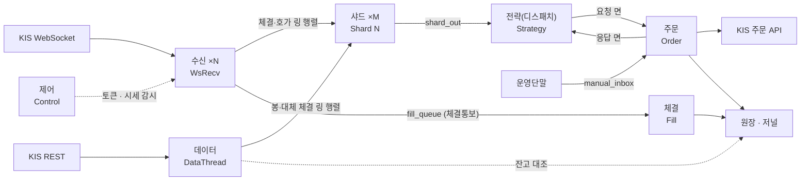
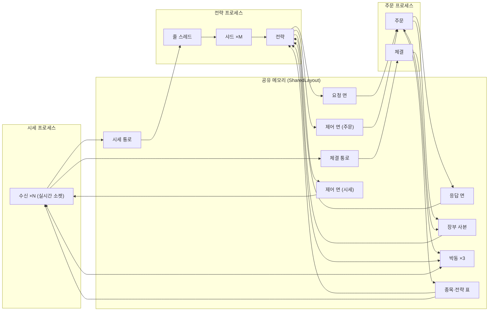

# 엔진 아키텍처 요약

`CLAUDE.md`에서 옮겨 온 스레드 모델·핵심 타입·국면·KIS·WebSocket·로깅 요약이다(2026-09-14, 매 호출의 문맥 바닥을 줄이려고).
헤더의 공개 역할이 바뀌면 이 문단을 고치고 `py ../quant-devtools/sync_impact.py --restamp docs/ENGINE_ARCHITECTURE.md`로 도장을 갱신한다
(규칙은 `docs/sync_map.toml`). 읽는 순서로 따라가는 코드 흐름은 [CODE_FLOW.md](CODE_FLOW.md), 결정 이력은 [DECISIONS.md](DECISIONS.md).

## 아키텍처

### 스레드 모델

<!-- sync: Quant/include/core/Engine.h@05e2d0d Quant/src/core/Engine.cpp@584a43c Quant/include/core/DataPoller.h@62f75bc Quant/include/core/SignalDispatcher.h@d27c5ea Quant/include/core/OrderRateLimiter.h@2650fb2 Quant/include/core/LedgerReconciler.h@77c1a8a Quant/include/core/WakeGate.h@b842ec7 Quant/include/core/BarAggregator.h@f50287c Quant/include/core/LatencyTrace.h@b01b770 Quant/include/core/ReconcilePlan.h@5e8d897 -->
스레드는 다섯 개(데이터·전략·주문·체결·제어)에 전략 샤드 M개(config `strategy_shards`, 기본 1, 상한 64), 소켓마다
수신 스레드 하나, 프리페치 풀(코어/4, 2~8개)을 더한다. 스레드끼리는 락 없는 큐로만 넘긴다. 각 스레드는 기동 직후
`thread_name::set_current`(`Quant/include/utils/ThreadName.h`)로 이름을 붙여 procwatch와 디버거에 그 이름으로 보인다.

#### 한 프로세스로 띄울 때 (`Both`, 기본)

#### 스레드

| 스레드 | 하는 일 | 받는 것 → 내보내는 것 | 코드 · 테스트 |
|---|---|---|---|
| 수신 ×소켓 | 소켓 읽기·디코드·수신 시각 `received_ns` 찍기·push만 | KIS WS → 행렬 행 i, `fill_queue`, 캡처 큐, ZMQ TRADE 큐 | `Quant/include/core/FeedMux.h` · `test_feed_mux` |
| 데이터 | `fetch_interval_sec`마다 REST 봉 폴링, 틱 끊긴 보유 종목 현재가 보충, 유니버스 재스캔(`rescan_interval_sec`), 주문 쪽이면 잔고 대조와 손익 갱신 감시 | KIS REST → `bars_matrix`, 원장 | `Quant/include/core/DataPoller.h`·`Quant/include/core/UniverseRescan.h`·`Quant/include/core/UniverseExit.h`·`Quant/include/core/LedgerReconciler.h` · `test_data_poller`·`test_universe_rescan` |
| REST 조회 | 시세 쪽이면. WS 칸에 못 든 종목(REST 폴백이면 유니버스 전부)의 현재가를 한 바퀴 1초 목표로 조회. 종목 사이 100ms라 10종목을 넘으면 한 바퀴가 늘어난다(D-138) | KIS REST → `trade_matrix` 폴러 행 | `Quant/include/core/DataPoller.h` · `test_data_poller` |
| 샤드 ×M | 자기 열을 비우고, 틱의 종목 id를 보는 전략만 부른다. 1분봉 집계는 이렇게 불린 전략 안에서 한다 | 행렬 열 m → `shard_out` | `Quant/include/core/StrategyShard.h`·`Quant/include/core/StrategyRouter.h` · `test_strategy_shard`·`test_strategy_router` |
| 전략(디스패치) | 신호를 주문 요청으로 바꾸기 전 판단, 보호 주문 판정, 강제청산·초과분 정리, 제어 요청 중계, 주문 쪽 응답 수거, 상대 박동 감시와 답 없는 요청 세기 | `shard_out` → 요청 면 / 응답 면을 비운다 | `Quant/include/core/SignalDispatcher.h`·`Quant/include/risk/ProtectiveOrders.h` · `test_signal_dispatcher` |
| 주문 | 게이트·발주·재시도, 수동주문, 제어 요청 적용, 슬롯 교체, 상대 박동 감시, 장부 사본 발행 | 요청 면·`manual_inbox`·제어 면 → KIS 주문 API, 응답 면, 장부 사본 | `Quant/include/core/OrderRateLimiter.h`·`Quant/include/risk/DisplacementDesk.h` · `test_order_rate_limiter`·`test_engine` |
| 체결 | 체결통보를 원장·CSV에 반영하고 운영단말에 방송 | `fill_queue` → 원장 | `Engine::fill_thread_fn` (D-056) |
| 제어 | 토큰 선갱신, 시세 끊김 대응(재연결·REST 대체), 구독 요청 반영·구독 칸 재배정(D-132), 큐 고수위 기록, 마감 자기 종료, 갈라 띄운 날에는 짝이 종료 사유를 적고 나갔는지 5초마다 보고 따라 내려가기 | 주기 작업 | `Quant/include/core/FeedSupervisor.h`·`Quant/include/core/SessionEndJudge.h` |
| 프리페치 ×2~8 | 전략이 `on_start`에서 맡긴 REST 당기기를 3초 간격으로 | 전략 스냅샷 | `Quant/include/core/PrefetchPool.h` · `test_prefetch_pool` (D-115) |
| 줄 스레드 ×(소켓+1) | 갈라 띄울 때만. 시세 통로 한 줄을 꺼내 행렬로 나눈다 | 시세 통로 → 행렬 | `Engine::feed_lane_thread_fn` · `test_market_feed_channel` |

#### 큐

| 큐 | 종류 | 넣는 쪽 → 꺼내는 쪽 | 칸 | 찼을 때 |
|---|---|---|---|---|
| `trade_matrix`·`order_book_matrix` | SPSC 링 N×M 행렬 (`Quant/include/core/ShardMatrix.h`) | 수신 i·데이터 → 샤드 m | 칸당 4,096 | 수신은 버리고 센다, 데이터는 기다린다 |
| `bars_matrix` | SPSC 링 행렬 | 데이터 → 샤드 m | 칸당 1,024 | 기다린다 |
| `shard_out` | MPSC | 샤드 여럿 → 전략 | 4,096 | 버리고 센다 (`shard_dropped`) |
| 요청 면 `requests` | SPSC, 자리표 위 | 전략 → 주문 | 1,024 | 버리고 센다 (`order_dropped`, D-073) |
| 응답 면 `order_responses` | SPSC, 자리표 위 | 주문 → 전략 | 1,024 | — |
| 제어 면 | SPSC, 자리표 위 | 전략 → 주문 | 16,384 | 버리고 `LOG_ERROR` (`control_relay_dropped`) |
| 시세 제어 면 (갈라 띄울 때) | SPSC, 자리표 위 | 전략 → 시세 | 8,192 | 버리고 `LOG_ERROR` (`control_relay_dropped`) |
| `ControlPlane::outbox_` | MPSC | 전략 프로세스의 여러 스레드 → 전략 | 8,192 | 전략 스레드가 제어 면으로 옮긴다 |
| `fill_queue` | SPSC | 수신 → 체결 | 1,024 | 칸은 문자열 없는 `ipc::FillNotice`(128바이트, 체결 통로와 같은 모양, W-7). 버리고 `LOG_ERROR` (`fill_dropped`). 넣는 쪽이 둘 겹치면 한 줄로 세우고 `fill_producer_overlap`에 센다(W-6) |
| `manual_inbox` | MPSC | 운영단말 서버 → 주문 | 256 | 단말에 거부로 답한다 |
| 시세 통로 (갈라 띄울 때) | 줄별 SPSC 한 쌍 (`Quant/include/ipc/MarketFeedChannel.h`) | 시세 쪽 수신 → 전략 쪽 줄 스레드 | 체결 16,384·호가 8,192 | 버리고 센다 (`feed_channel_overflow`) |
| 체결 통로 (갈라 띄울 때) | SPSC 하나 (`Quant/include/ipc/FillChannel.h`) | 시세 쪽 수신 → 주문 쪽 체결 스레드 | 1,024 | 버리고 센다 (`fill_channel_overflow`) |

버리고 세는 카운터는 제어 스레드가 1분마다 `[큐 고수위]` 줄에 싣고, `scripts/check_runtime_health.py`가 0이 아니면 FAIL로 판정한다.
큐가 비면 소비자는 `Quant/include/core/WakeGate.h`의 `wake::WakeGate`에서 잠들고 생산자가 깨운다 — 전략은 200us yield 뒤,
주문은 재시도 만기까지 잔다(D-071, `test_wake_gate`). 갈라 띄운 판의 시세 줄 스레드만 깨워 줄 생산자가 건너편
프로세스에 있어 스스로 깬다 — 이때는 `wake::sleep_precise_unless_stopped`로 잔다. OS 타이머 격자를 타는
`condition_variable`로 자면 500us를 부탁해도 1.5~15ms를 자고 그만큼이 시세 지연에 그대로 실린다(D-137).

#### 주문 한 건 따라가기

1. 수신 스레드가 체결을 디코드해 `received_ns`를 찍고, ZMQ TRADE 발행 큐에 먼저 넣은 뒤 그 종목을 보는 샤드의 행렬 칸에 넣는다.
   종목 → 샤드는 `Quant/include/core/ShardRoutes.h`의 비트마스크로 고른다(D-110).
2. 샤드 스레드가 전략의 `on_data`를 부른다. 전략은 종목을 `on_start`에서 받은 정수 id로만 비교한다(원칙 6).
   `NONE`이 아닌 신호는 `strategy::Emitted`로 `shard_out`에 들어간다.
3. 전략 스레드의 `SignalDispatcher`가 비활성 전략의 신규 매수, 청산 관리 종목의 신규 주문(매수·매도), 수동 매도 정지(D-095)를
   거른 뒤 순번 `seq`를 찍어 문자열 없는 고정 레코드 `ipc::OrderRequest`로 요청 면에 넣는다.
4. 주문 스레드가 꺼내 `ipc::is_plausible`로 값을 보고 `ipc::to_signal`로 되살린다. 1초 넘게 기다린 신규 매수는
   보내지 않는다 — 초당 주문 한도가 꺼내는 속도를 정하므로 낡은 판단이 새 판단의 자리를 먹는다. 취소·정정·매도는 나이를 안 본다(D-127).
5. `OrderRouter`가 `OrderGate::check()` → 저널에 INTENT 선기록(`PositionLedger::on_intent`) → 초당 한도 대기 → KIS 발주를 한다.
   재시도 분류와 최소 간격은 `OrderRateLimiter`(D-065). 구간별 소요는 `logs/latency_trace.csv`에 한 줄씩(D-117).
6. 종착 상태는 `ipc::OrderResponse`로 응답 면에 돌아가고, 체결통보는 수신 → `fill_queue` → 체결 스레드가 원장에 반영한다.

운영단말 수동주문은 3단계를 건너뛰고 `manual_inbox`로 바로 주문 스레드에 간다. 전략 프로세스가 멎어도 사람이 낼 수 있게
꺼내는 쪽을 주문 쪽에 두었다(D-114 단계 4).

#### 세 프로세스로 나누기 (D-114, 모의계좌 시험 중)

`--role order`·`--role strategy`·`--role feed`로 띄우면 주문 프로세스가 공유 메모리(`quant.engine.<paper|live>.<계좌번호>`,
`Quant/include/ipc/SharedRegion.h`)를 만들고 전략·시세가 거기 붙는다. 셋 중 하나라도 빠진 조합은 감시견이 거절한다 —
실시간 소켓을 쥐는 것이 시세 역할이라, 시세가 없으면 시세도 체결통보도 안 들어오는데 나머지는 멀쩡히 떠 있다.
`Both`일 때는 같은 바이트가 힙 한 덩이에 앉을 뿐 넣고 꺼내는 코드는 같다 — 고르는 자리는 `Engine::bind_layout` 하나다.

| 공유 면 | 하는 일 | 코드 · 테스트 |
|---|---|---|
| 요청·응답 면 | 주문 요청과 종착 상태. 문자열·포인터 없는 고정 레코드 | `Quant/include/ipc/OrderChannel.h` · `test_order_channel` |
| 제어 면 (시세) | 구독·해지·구독 칸 우선순위만 여기로 간다. 어느 낱말이 어느 줄로 가는지는 `ipc::routes_to_feed` 하나가 정한다 | `Quant/include/ipc/ControlChannel.h` · `test_control_channel` |
| 체결 통로 | 시세 소켓에 실려 온 체결통보를 주문 쪽으로 나른다. 종목 코드와 증권사 주문번호는 글자 그대로 간다(번호를 다는 쪽이 주문뿐이고, 앞의 0을 잃으면 취소·정정에 못 쓴다) | `Quant/include/ipc/FillChannel.h` · `test_fill_channel` |
| 제어 면 (주문) | 전략이 주문 쪽 표를 고칠 때(슬롯 면제·진입 우선순위·보호 주문 등록·종목 등록)와 스위치 다섯(하루치 새로 열기·신규진입 정지·매수 비율·전방향 차단·수동 정지). 여러 줄 표는 온전히 모였을 때만 건다 | `Quant/include/ipc/ControlChannel.h`·`Quant/include/core/ControlPlane.h` · `test_control_channel`·`test_control_plane` |
| 장부 사본 | 보유·미체결 선점(순값과 매도분)·매도가능·평단과 전역값. 판 번호로 묶여 읽는 쪽은 잠금 없이 읽는다. 발주 한 바퀴마다, 기동 직후 한 번, 한가할 때 100ms마다 낸다 | `Quant/include/ipc/LedgerSnapshot.h` · `test_ledger_snapshot` |
| 박동 | 칸이 셋이고 서로를 본다. 전략 쪽은 의심 250ms·끊김 1,000ms — 죽으면 주문 쪽이 신규 진입을 끊고 보호 주문을 이어받는다(주문 쪽은 내려가지 않는다). 주문 쪽은 의심 30초·끊김 60초로 훨씬 헐겁다. 그 공백에 증권사 왕복(윈도 전송 10초·수신 15초)이 그대로 들어오기 때문이고, 그래서 끊겨도 찍고 셀 뿐 아무것도 멈추지 않는다 | `Quant/include/ipc/Heartbeat.h` · `test_heartbeat` |
| 국면 칸 | 전략이 고른 국면(`apply_regime_selection`)을 담는 값 한 칸이다. 링이 아니라 상태라, 붙는 쪽은 뜨는 순간 지금 국면을 그대로 읽는다 — 낱말로 흘려보내면 다음 전환까지 빈 채로 돌고, 장중에 주문 프로세스만 다시 뜬 날은 그날 내내 빈다. 주문 쪽이 체결 한 건마다 읽어 `fills.regime`을 채운다. 놓는 쪽이 `-1`로 밀어야 판정 전 체결이 국면 0(RISK_ON)으로 적히지 않는다(D-129) | `Quant/include/ipc/RegimeCell.h` · `test_shared_layout` |
| 종목·전략 표 | 이름 ↔ 번호. 넣는 쪽은 주문 프로세스 하나, 전략 쪽은 등록을 요청하고 번호가 뜨기를 기동 중에는 5분, 스레드가 뜬 뒤에는 300ms까지 본다. 시세 쪽은 찾기만 하고 표에 없는 티커는 버리고 센다(`unknown_ticker_dropped`) — 청하지 않은 종목이 세션에 실려 온 것이다 | `Quant/include/ipc/SharedSymbolDictionary.h`·`Quant/include/ipc/SharedStrategyDictionary.h` · `test_shared_symbol_dictionary` |
| 시세 통로 | 줄 = 소켓, 마지막 한 줄은 REST로 대신 받는 종목. 꺼내는 쪽이 `ipc::MarketLimits`로 값을 보고 어긋나면 버린다(`feed_channel_discarded`) | `Quant/include/ipc/MarketFeedChannel.h` · `test_market_feed_channel` |

스레드도 역할대로 갈린다 — 시세 역할은 수신, 주문 역할은 주문·체결, 전략 역할은 줄·샤드·전략을 띄우고,
데이터·제어 스레드는 역할마다 하나씩 두되 맡는 일이 다르다. 샤드는 스레드뿐 아니라 객체와 그 앞 큐 행렬까지
전략 역할에서만 만든다 — `Engine::setup_shards`가 줄 수만 정하고 다른 역할에서는 거기서 나간다. 스위치 중 매크로 국면이 내는 둘(신규진입 정지·매수 비율)은 전략 쪽 일이라
`Both`에서도 제어 면을 타고, 나머지 셋은 주문 쪽에서 그 자리에서 고친다.
같은 계좌에 엔진이 둘 뜨는 것은 공유 메모리 이름이 이미 있으면 만들지 않는 것으로 막는다. 붙는 쪽(전략·시세)은 이름이 없으면
30초까지 기다리고 그래도 없으면 뜨지 않는다. 쪽지 머리에는 주인 표(번호 + 기동 시각)·기동 번호·종료 사유가 있다
(`Quant/include/ipc/SharedRegion.h`, D-114 단계 4-b) — 주인이 죽었으면 다음 기동이 물려받으며 기동 번호를 올리고(짝 자리에 아직 사는 프로세스가 있으면 물려받지 않고 기동을 멈춘다 —
감시견이 그 짝을 거둔 뒤 다시 띄운다),
붙어 있던 쪽은 제어 스레드가 5초마다 그 번호를 견주어 달라졌으면 옛 판을 들고 주문을 내지 않도록 같이 내려간다.
종료 사유는 스레드를 다 회수한 `stop()` 끝에서 적으므로, 빈 칸으로 남은 것이 크래시다.

#### 원장과 재기동

- 주문을 보내기 **전에** `Quant/include/risk/LedgerJournal.h`가 `ledger_YYYYMMDD.bin`(192바이트 고정 레코드, 순번·CRC32)에
  INTENT를 적는다. 못 적으면 주문을 보내지 않고, 저널을 못 열면 기동하지 않는다.
- 기동은 저널을 처음부터 리플레이해 보유·평단·선점·현금·당일손익을 되쌓고, 잔고 시드와 대조한 뒤, 결말을 못 본 주문은
  KIS 미체결조회로 맞춘다. DB는 복제본이다(`PYQuant/tools/ledger_recorder.py`, D-113).
- 주기 잔고 대조는 `LedgerReconciler`(D-061)가 한다. 체결 직후 5초는 미루고 30초마다 한 번은 돈다(D-074).
  잔고 조회는 뒤 스레드에서 돌고 한 사이클은 500ms만 기다린다(D-100). 어긋난 종목만 `Quant/include/core/ReconcilePlan.h`가
  골라 `RECONCILE` 행(`OVERWRITE|PRUNE|KEEP`)을 쓰고, 원장 CSV의 모든 행에는 신호의 `seq`가 남는다(D-038).

#### 시세 끊김과 마감

- WS가 끊기면 `Quant/include/core/FeedSupervisor.h`가 판정한다 — 장 외는 무시, 재연결 백오프 30×n초(상한 300초),
  연속 3회 실패면 REST 폴백. 제어 스레드는 멈춘 소켓만 다시 잇고 폴백을 적용한다(D-071, `test_feed_supervisor`).
- 마지막 매매 창이 닫히고 `risk.session_end_grace_sec`(기본 120초) 뒤 요청 면이 비면 `_private/state/session_done_<날짜>`를
  쓰고 스스로 내린다. 감시견은 그 파일을 보면 그날 다시 띄우지 않는다(D-098, `test_session_end`).

#### 그 밖의 규칙

- 티커 → 번호는 두 길이다. 느린 경로(기동·재스캔·종목명)는 `Engine::register_symbol`이 없으면 넣어서 받고, 잦은 경로
  (신호·현재가)는 `Engine::lookup_symbol`이 있는 번호만 주고 없으면 `kNone`을 주며 센다(`symbol_lookup_miss`, D-106).
  WS 수신 콜백은 표에 직접 `intern`해 체결·호가에 번호를 찍는다.
- 프리페치 풀 스레드 수는 전략 수와 무관하게 고정이고, 한 작업이 두 스레드에서 겹쳐 돌지 않는다. 종료 순서는
  전략 정리 → 풀 `stop()`이다. 전략 스냅샷은 `std::shared_ptr<const std::vector<MarketData>>`라 락 안에서 포인터만 바꾼다.
- 시각은 정수 HHMMSS(`hhmmss`)다. 문자열로는 화면·캡처 파일에서만 되돌린다(`Quant/include/core/MarketSession.h`, D-071).
- 3분봉은 config `bar_source`로 고른다. `"ws"`(기본)는 샤드 스레드에서 도는 전략이 체결로 1분봉을 모아 판단 직전에
  `interval_min` 봉으로 묶고, `"rest"`는 REST 3분봉을 그대로 쓴다(`Quant/include/core/BarAggregator.h`, D-068·D-069·D-072·D-074).
- 보호 주문(손절·트레일)은 전략이 `on_start`에서 등록하고 전략 스레드가 원장만 보고 판정한다(나눠 띄운 전략 역할은 주문 쪽이 공유 면에 올린 원장 사본으로 판정한다). config `protective_orders`
  (`off`/`shadow`/`owner`, 기본 `shadow`). 전략 박동이 끊기면 주문 스레드가 이어받고, 둘이 같은 차례를 잡지 않게
  `Engine::claim_protective_cycle`이 한쪽만 통과시킨다(D-114 단계 1·2, `test_protective_orders`).
- ZMQ 포트는 엔진 한 대가 `zmq_pub_port`부터 **4포트 연속 블록**을 갖는다 — 주문 PUB(`zmq_pub_port`) · 제어
  REP(`zmq_rep_port`) · 시세 PUB(`zmq_feed_pub_port`, 안 적으면 +2) · 전략 PUB(`zmq_strategy_pub_port`, 안 적으면 +3).
  모의는 5555~5558, 실계좌는 5565~5568이다. 역할마다 발행 다리를 하나씩 열고, 제어(REP)는 주문 쪽에만 둔다 —
  한 포트로 모으면 그 자리가 죽을 때 셋이 같이 멎어 프로세스를 가른 뜻이 없어진다(D-129). 구독자는 SUB 소켓
  하나에 connect를 여럿 건다. 발행 큐에는 `TradeData`를 memcpy로만 넣고 JSON은 송신 스레드가 만든다
  (D-105, `bench_zmq_publish`).
- `Quant/src/main.cpp`가 `timeBeginPeriod(1)`로 sleep 격자를 15.6ms에서 2ms로 내린다.

### 남는 것과 가는 곳

엔진은 같은 사건을 네 군데에 따로 남긴다. 넷은 서로 상류·하류가 아니라 각자 독립이라, 하나가 막혀도 나머지는 남는다.

| 남는 것 | 무엇이 | 형식 | 켜는 설정 | DB까지 |
|---|---|---|---|---|
| 거래 원장 `logs/trades_YYYYMMDD.csv` | 주문 종착 상태·체결·잔고 대조 | 텍스트(CSV) | 없음 — 늘 켜짐 | 상시 경로 없음. 빠진 체결만 [scripts/backfill_fills_db.py](../scripts/backfill_fills_db.py)로 뒤에 채운다 |
| 원장 저널 `ledger_YYYYMMDD.bin` | 주문 의도·접수·거부·체결·취소·조정·시드·현금·당일손익 | 바이너리 — 192바이트 고정 레코드, 순번·CRC32 ([LedgerJournal.h](../Quant/include/risk/LedgerJournal.h)) | `ledger_journal_dir` | [PYQuant/tools/ledger_recorder.py](../PYQuant/tools/ledger_recorder.py)가 파일 꼬리를 따라 읽어 `ledger_events` |
| 시세 캡처 `ticks_<기동시각>.bin` | 체결·호가·일봉·그날 유니버스 | 바이너리 — QTCAP v2 ([TickCapture.h](../Quant/include/core/TickCapture.h)) | `capture_dir` | 안 간다. 리플레이 백테스트 입력이다 |
| ZMQ 발행 | 체결틱·신호·주문·체결·엔진 상태 | 토픽 한 프레임 + JSON 한 프레임 ([ZmqBridge.cpp](../Quant/src/ipc/ZmqBridge.cpp)) | `zmq_pub_port` 블록 (ZeroMQ가 링크돼 있으면 늘 켜짐) | [PYQuant/main.py](../PYQuant/main.py) `record`가 구독해 표 6개에 넣는다 |

읽을 때 헷갈리기 쉬운 세 가지.

- 주문은 **ZMQ 발행이 CSV 기록보다 먼저** 나간다. CSV가 발행의 상류가 아니다.
- 시세는 캡처와 발행이 담는 것이 다르다 — 호가와 일봉은 캡처에만 있고 발행되지 않는다.
- 잃는 방식이 다르다. 저널은 못 적으면 주문을 아예 안 보내고(그래서 정본), 캡처는 큐가 차면 버리고 센 다음 넘어가며,
  ZMQ는 구독자가 느리면 큐 상한에서 버린다. 되짚을 근거로 삼을 것은 저널이고 DB는 그 복제본이다.

### 핵심 타입 (`Quant/include/core/Types.h`)

<!-- sync: Quant/include/core/Types.h@876bac8 -->
`MarketData`(OHLCV + bar_index), `OrderSignal`(side/type/quantity/price/**reference_price** + strategy_id, 종목 id `symbol_id`는 전략 스레드가 큐에 넣기 전에 찍고, 전략 번호 `strategy_index`·주문 번호 `client_order_number`는 정수라 게이트·라우터가 문자열 없이 찾는다, D-112), `Position`, `OrderBook`(5단계 호가, 채널 `H0STASP0`/선물 `H0IFASP0`), `TradeData`(실시간 체결, 채널 `H0STCNT0`/선물 `H0IFCNT0`; 호가·체결 모두 종목 id `symbol_id`와 정수 시각 `hhmmss`를 들고, 봉·호가·체결의 `ticker`는 `symbol::Ticker` 15자 고정 배열이라 세 구조체는 trivially copyable이다 — 문자열은 `.str()`, D-071), `WatchSpec`(FEED 구독 종목 명세 — `is_future` 플래그로 현·선 채널 선택), `Regime`(enum: BULL/NEUTRAL/BEAR/UNKNOWN), `OrderStageTiming`(주문 한 건이 라우터 안에서 구간마다 쓴 시간 — 리스크 점검·이력 잠금과 중복 가드·원장 선기록·초당 한도 대기·증권사 왕복·전송 뒤 마무리 여섯. 그중 둘은 다시 갈라 싣는다: 이력 잠금은 기다린 몫, 전송 뒤 마무리는 접수 확정·발행·이력 저장 셋(이력 저장 안의 미결주문 파일 다시쓰기 몫은 따로 한 칸 더) — 더할 때 두 번 넣지 않는다, D-126. 관측 전용이라 매매 판단에는 안 쓴다, D-117), `FillNotification`(체결통보 한 건 — 주문번호·원주문번호·종목·방향·체결수량·체결단가·체결시각에 주문수량 `order_quantity`와 주문거래소 `exchange`가 붙는다. 뒤쪽 두 칸은 전문이 짧으면 안 오므로 0·빈 값이 모른다는 뜻이다, D-121. 실어 온 실시간 세션 번호 `session_generation`도 붙어, 재연결 뒤 다시 온 같은 체결을 라우터가 가른다, D-131).

> `OrderSignal.reference_price`는 시장가(price=0) 주문의 명목 한도 평가 기준가다. 지정가는 `price`로 명목을 재지만 시장가는 `price`가 0이라 이 값이 없으면 명목 백스톱이 우회된다(특히 급락장 강제청산의 시장가 전량매도). 발주 측이 직전 현재가/평단을 stamp한다.

### 국면(Regime) 대응

<!-- sync: Quant/include/core/RegimeFileJudge.h@2d4e270 -->
전략 집합 선택·매수 비율·신규매수 정지·강제청산은 전부 한 입력, 매크로 보조 프로세스(`PYQuant/tools/macro_regime_feed.py`)가 3분마다 쓰는 `regime.json`(config `regime_file`·`regime_stale_sec`)에서 나온다(D-084). 코스피·코스닥·나스닥·S&P 선물·10년물·VIX·환율·WTI 8개 투표가 점수가 되고, 파일의 `regime` 라벨(RISK_ON/NEUTRAL/RISK_OFF, 판정 보류면 UNKNOWN)·`entry_scale`(매수 명목 비율 0~1, D-083)·`entry_halt`(비율 0과 같은 뜻)·`force_liquidate`가 각각 다음으로 간다 — 라벨은 RISK_ON→BULL·NEUTRAL·RISK_OFF→BEAR로 옮겨 **라벨이 바뀐 회차에만** `Engine::apply_regime_selection`이 config `"regime_strategies": {"RISK_ON":[id…],"NEUTRAL":[…],"RISK_OFF":[…]}`(종전 `BULL`·`BEAR` 키도 같은 뜻, `'*'` 접두 매칭) 기준으로 전략의 `active_`를 켜고 끈다(맵이 없으면 전략별 `active_regimes`로 하위호환, 맵이 등록 전략과 하나도 안 맞으면 WARN). `entry_scale`은 `OrderGate::set_entry_scale`로 넘어가 `DeviationScaleStrategy`가 베이스·물타기 명목에 곱하고, `entry_halt`는 `OrderGate::set_entry_halt`(신규매수만 차단, 청산은 통과)를 토글하고, `force_liquidate`는 여기에 더해 strategy_thread가 보유 전량에 대해 `FORCE_LIQ` 시장가 매도를 2초 간격으로 재발주하게 한다. 파일의 갱신 지연(stale)·무효(valid=false)·모르는 라벨은 이전 값을 유지하며, 개장 후 만료(시간 상자, 기본 0=끔)·전이·1회 로그 판정은 `Quant/include/core/RegimeFileJudge.h`의 상태기계가 맡고 `Engine::poll_regime_file`은 파일 읽기와 적용만 한다(D-060, `test_regime_file_judge`). 드릴 절차는 [docs/guides/REGIME_DRILL_GUIDE.md](guides/REGIME_DRILL_GUIDE.md).

코스피 하나의 200일선·정배열로 BULL/NEUTRAL/BEAR를 따로 내던 `RegimeController`는 전략 on/off 말고 하는 일이 없어 09-14에 지웠다(D-085). `[RegimeSelect] 국면=RISK_ON …` 줄의 국면도 `regime.json` 라벨이다.

### 전략 추가하기

1. `StrategyBase`(`Quant/include/strategy/StrategyBase.h`)를 상속합니다.
2. `id()`, `on_data(const MarketData&)`, `describe()`를 구현합니다. 종목 비교는 문자열이 아니라 `on_start`에서 `symbol_of(ticker)`로 받은 id와 `trade.symbol_id`로 합니다(`same_symbol` 헬퍼). 신호에는 `signal.symbol_id`를 찍습니다.
3. `Quant/src/strategy/StrategyFactory.cpp`의 타입별 로더에서 `engine.add_strategy(std::make_unique<YourStrategy>(...))` 로 등록합니다.
4. 필요하면 `"strategies"` 아래에 설정 항목을 추가하고 같은 로더에서 파싱합니다(전략 배열 밖의 키는 `Quant/src/core/AppConfig.cpp`의 `parse_config`만 읽습니다).

### KIS API 클라이언트 (`Quant/include/api/KisClient.h`, 멤버 구현은 7파일, 목록 `Quant/src/api/KisClientInternal.h`, 자유 함수는 `KisClient.cpp`)

<!-- sync: Quant/include/api/KisClient.h@6e8afb9 Quant/include/api/KisResult.h@654719e Quant/include/api/KisTypes.h@49c411a Quant/include/api/KisRestDecode.h@56c698e Quant/include/api/IOrderExecutor.h@12782fe Quant/include/api/IMarketDataSource.h@8c8d745 -->
클래스는 하나고 구현이 도메인별로 나뉩니다(D-048): `KisTransport.cpp`(플랫폼별 HTTP — Windows는 WinHTTP, Linux는 libcurl — 재시도·초당 한도·공용 인증 헤더 `authentication_headers()`), `KisAuth.cpp`(OAuth2 토큰 발급·캐시), `KisMarket.cpp`(주식 시세 — 분봉 페이지 병합·집계는 순수 함수 헤더 `Quant/include/api/KisRestDecode.h`, D-051), `KisIndex.cpp`(지수·수급·선물), `KisOrder.cpp`(주문 — config `kis.exchange`(KRX/NXT/SOR)가 `EXCG_ID_DVSN_CD`와 tr_id `TTTC0012U/0011U/0013U`를 정한다, D-096), `KisAccount.cpp`(잔고·미체결), `KisUniverse.cpp`(순위·유니버스), `KisClient.cpp`(어디에도 안 붙는 공용 함수 — 주문 거래소 코드 고르기, hhmmss 에서 분 빼기). 구현끼리만 쓰는 include·상수는 `Quant/src/api/KisClientInternal.h`. 주요 메서드: `authenticate()`, `get_chart_ohlcv()`, `get_current_price()`, `send_order()`, 국내 선물 시세 `get_future_price()`(단일 시세)·`get_future_board()`(전광판, 그릭스 포함). 새 REST 호출은 인증 헤더 네 줄을 손으로 쓰지 말고 `authentication_headers(tr_id, {추가 항목})`을 씁니다. 공개 헤더는 `nlohmann::json`을 내보내지 않습니다 — 잔고 `get_balance()`·미체결 `get_open_orders()`·전광판 `get_future_board()`는 `KisResult<T>`(`Quant/include/api/KisResult.h`, 실패 코드 동반) 봉투에 값 타입(`Quant/include/api/KisTypes.h`)을 담아 돌려주고, 응답 필드 해석은 `Quant/include/api/KisRestDecode.h`의 순수 함수가 맡습니다(D-059). 인터페이스는 둘을 구현합니다 — 주문 `IOrderExecutor`(`Quant/include/api/IOrderExecutor.h`, D-039)와 읽기 전용 시세·봉 `IMarketDataSource`(`Quant/include/api/IMarketDataSource.h`, D-066 — 현재가·일봉·분봉·지수 일봉·지수 현재값·해외 일봉). 순위·수급·잔고는 인터페이스 밖입니다. 거래대금 상위(`fetch_value_ranking`)와 시가총액 상위(`fetch_kr_ranking`)는 한 번에 30행이 상한이고 연속조회가 없어, 그보다 많이 달라고 하면 가격 구간을 갈라 두 번 부르고 합칩니다 — 거래대금 쪽은 ETF·ETN을 제외 마스크로 KIS 쪽에서 빼고, 시가총액 쪽은 그 마스크를 API가 막아 두어 보통주 구분값과 이름 필터로 거릅니다(2026-09-23 실측). 시세 전용 클라이언트가 주문 클라이언트와 앱키·도메인이 같으면 `share_rate_limit_with()`로 초당 한도 버킷 하나를 같이 씁니다 — 따로 세면 합쳐 공표 한도의 두 배까지 나갔습니다(D-138). 주문 스레드가 초당 한도 버킷에서 기다린 시간은 `IOrderExecutor::rate_limit_wait_ns_this_thread()`로 재서 접수·거부 로그의 `버킷대기=`에 남깁니다(전송 분리 여부는 이 숫자로 정한다, T-13-2). 모의·실계좌 REST 접속점(호스트·포트)은 `Quant/include/api/KisEndpoints.h`의 `rest_base_url()` 한 곳에서 옵니다 — 파이썬 쪽 같은 표는 `PYQuant/kis/endpoints.py`입니다(T-13-3).

### WebSocket 클라이언트 (`Quant/include/api/KisWebSocket.h`, 구현은 `Quant/src/api/KisWebSocket.cpp`·`WebSocketClient.cpp`(연결·재연결·구독)·`KisWebSocketParse.cpp`(수신 프레임 파싱) + `WsSocketWin.cpp`/`WsSocketPosix.cpp`)

<!-- sync: Quant/include/api/KisWebSocket.h@06d06f6 Quant/src/api/WebSocketClient.cpp@fa17b00 Quant/src/api/WsSocket.h@9bf614c -->
REST로 approval key를 발급받고, `ops.koreainvestment.com:31000`(모의) 또는 `:21000`(실거래, 호스트·포트 상수는 `Quant/include/api/KisEndpoints.h`)에 연결한 뒤 구독한 채널의 파싱된 구조체를 등록된 콜백으로 전달합니다. 구독 채널은 종목당 `WatchSpec`으로 정하며, 국내 현물 호가 `H0STASP0`·체결 `H0STCNT0`(config `kis.exchange`가 NXT·SOR이면 KRX+NXT 통합 `H0UNASP0`·`H0UNCNT0`, D-096), 국내 선물 호가 `H0IFASP0`·체결 `H0IFCNT0`(`WatchSpec.is_future=true`로 선택), 미국 체결 `HDFSCNT0`을 지원합니다. 선물 체결에는 매수/매도 방향 코드가 없어 `direction`을 0으로 둡니다. 최초 연결·재연결 경로에 흩어져 있던 구독 하드코딩은 `subscribe_all()` 한 곳으로 통합되어, 재연결 시 선물 채널이 누락되던 불일치를 없앴습니다. 구독 종목이 하나도 없어도 체결통보(`H0STCNI0`/`H0STCNI9`)는 겁니다 — 주문만 맡은 프로세스는 구독 목록이 빈 채로 연결하고 종목은 뒤에 제어 요청으로 옵니다(D-114 단계 4). 국내 선물 실시간은 실계좌 WS 도메인 전용이라 모의(`is_paper=true`)에서는 지원되지 않습니다. 소켓 계층은 `Quant/src/api/WsSocket.h`의 `WsSocket` 인터페이스 뒤에 있고(D-049) 플랫폼당 한 파일만 링크되므로, 연결·재연결·백오프·구독은 `WebSocketClient.cpp`에, 수신 프레임을 채널별로 나눠 디코더에 넘기는 파싱은 `KisWebSocketParse.cpp`에 플랫폼 코드 없이 한 벌씩 있습니다. 공개 헤더는 `<windows.h>`를 끌어오지 않습니다. 엔진은 소켓을 `feed::IFeedSource`(`Quant/include/core/IFeedSource.h`)로만 보며 — `Engine::set_feed_source`로 소스를 직접 주거나 config `replay_file`로 캡처 파일을 틀면 KIS 없이 기동해(인증·계좌·유니버스 스캔 없음) 주문·잔고를 모의 체결기가 받는다(`test_engine`이 시험용 시세로 수신 스레드 1×샤드 1과 2×2를, 캡처 파일로 리플레이를 한 바퀴씩 돈다, D-071) — config `feed_keys`로 세션 키를 더 주면 `Quant/include/core/FeedMux.h`의 `feed::FeedMux`가 소켓 여럿을 한 소스로 묶어(종목은 한 소켓에만, 체결통보는 `hts_id`를 가진 소켓 하나만 — `feed_keys` 항목에 `fill_notice: true`를 주면 그 키로 옮긴다, D-114 단계 3) 구독 상한이 소켓 수만큼 늡니다. 소켓이 새로 붙을 때마다 세션 번호가 1씩 오르고 체결통보마다 실립니다 — 재연결 직후 KIS가 다시 보낸 같은 통보를 `OrderRouter`가 새 체결로 세지 않게 하려는 것입니다(D-131). 소켓 하나가 멈추면 그 소켓만 자기 배정 종목으로 다시 잇고 나머지 소켓의 틱은 그 사이에도 흐릅니다(`reconnect_stale`, D-071, `test_feed_mux`). 엔진은 직접 호출 모드로 받는다 — 소켓 i의 수신 스레드가 번호 i를 달고 콜백을 직접 불러 행렬의 행 i에 넣고(`IFeedSource::lanes()`·`set_lane_callbacks`, mux 스레드 없음), 틱 캡처 큐는 그래서 `MpscQueue`다(D-071, `test_feed_mux`). 캡처 파일(`Quant/include/core/TickCapture.h`, 형식 v2)에는 체결·호가 외에 그날 구독한 종목 목록(체결만 받는지 표시 포함)과 일봉 폴링이 파이프라인에 넣은 봉이 같이 남고, 리더는 v1 파일도 읽으며 모르는 레코드 종류는 길이만큼 건너뛴다 — 리플레이(`Quant/include/core/ReplaySource.h`)는 체결·호가만 재생한다(D-071, `test_tick_capture`). 구독 칸(세션당 40건, 국내 종목 하나가 호가+체결 2건)은 앱키가 계좌당 하나라 늘릴 수 없어서, 보유 → 주문 대기 → 재스캔 점수 순위로 나눠 줍니다 — 전략 쪽이 우선순위를 매겨 보내고 시세 쪽 감시 루프가 `Quant/include/core/WebSocketSlotPlan.h`의 `plan()`으로 내줄 종목과 받을 종목을 고릅니다. 내준 종목은 `tr_type` "2"로 구독을 풀고(`unsubscribe_incremental`) REST 현재가로 계속 받습니다. 보유·주문 대기 종목은 칸을 내주지 않고, 받은 지 60초 안 된 종목·순위 차 10 미만은 바꾸지 않습니다(D-132, `test_websocket_slot_plan`).

### 부하시험 피드 (`Quant/include/exchange/ZmqOrderFeed.h`)

스레드 모델은 그대로입니다. `exchange::ZmqOrderFeed`도 `feed::IFeedSource` 구현이라 KIS 소켓이 앉던 자리에 그대로 들어가고
(`Engine::set_feed_source`), 수신 스레드 수는 config `load_test.lanes`가 정합니다. 바깥에서 ZMQ로 들어온 가상 주문을
`exchange::MatchingEngine`(`Quant/include/exchange/MatchingEngine.h`)의 종목별 오더북에 넣어 단일가·연속매매로 맞추고,
거기서 난 체결을 시세처럼 파이프라인에 올립니다. 전문 형식은 `Quant/include/exchange/OrderWire.h`(머리 16바이트 + 32바이트
고정 레코드)이고 파이썬 짝은 `PYQuant/tools/load_injector.py`입니다. config 는 `scripts/make_load_test_config.py`가 만듭니다.
`ZmqOrderFeed::Options::start_receive_threads`를 false 로 두면 소켓도 스레드도 없이 `ingest()`로 바이트를 직접 먹일 수 있어
한 스레드에서 디버거를 붙일 수 있습니다(`Quant/tests/test_zmq_order_feed.cpp`·`Quant/tests/test_matching_engine.cpp`).

### 로깅

<!-- sync: Quant/include/utils/Logger.h@403e40b -->
싱글톤 `Logger`가 밀리초 단위 로컬 시각(`localtime`) 타임스탬프로 콘솔과 `logs/quant_trader.log`(cwd 하위 `logs/` 폴더에 고정, 부모 폴더는 자동 생성)에 기록합니다. 과거 로그는 `logs/archive/`에 보관합니다. 사용 매크로: `LOG_INFO()`, `LOG_WARN()`, `LOG_ERROR()`, `LOG_DEBUG()`. 기본 임계값은 INFO이고 config `"log_level": "DEBUG"`가 봉 닫힘(D-069)·KIS 응답 본문 같은 DEBUG 줄을 연다 — 비교표를 뽑는 날만 켠다(`PYQuant/tools/compare_ws_bars.py`).

**비동기 구조**: 전략·주문 hot path는 레코드를 큐에 push만 하고 즉시 반환하며, 타임스탬프 포맷팅과 파일/콘솔 I/O는 전용 writer 스레드가 담당합니다(저지연은 평균 지연보다 최악 지연(tail latency)이 중요하다는 설계 의도로 디스크 플러시를 hot path에서 분리). 큐는 락 없는 `MpscQueue<Record>`(65,536슬롯)이고 writer는 큐가 비면 condvar에서 자며 생산자는 writer가 "잔다"고 표시한 때만 깨웁니다(D-045). 밀림 처리: 큐가 가득 차면 새 레코드를 드롭하고 `dropped()`로 셉니다(hot path 블로킹 방지). 종료·테스트 직전 정합 확인용 `flush()`를 제공합니다. 큐·writer 스레드·파일 핸들은 헤더가 아니라 `Quant/src/utils/Logger.cpp`의 `Logger::Implementation`에 있습니다 — 이 헤더를 34개 파일이 직접 포함해, 로거 내부를 한 줄 고칠 때마다 전체가 다시 컴파일됐습니다(80초). 지금은 내부 수정이 `Logger.cpp` 한 파일만 다시 컴파일합니다(16초).
