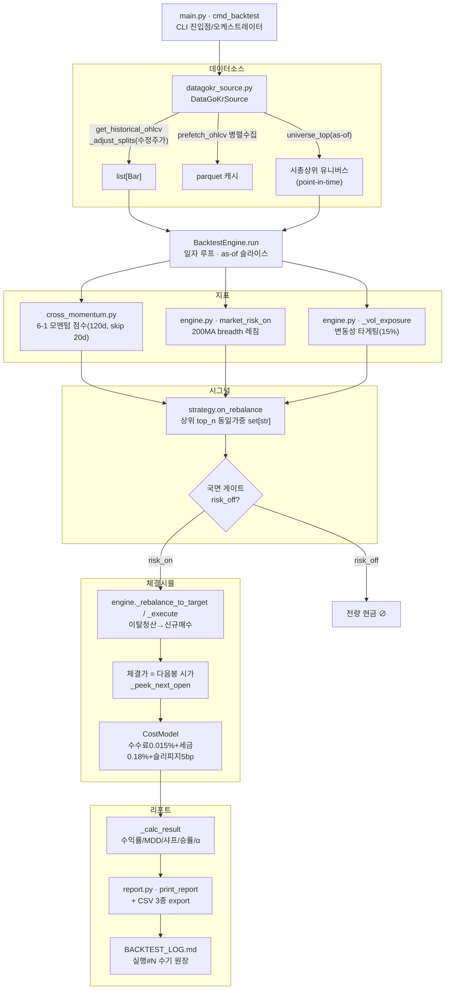
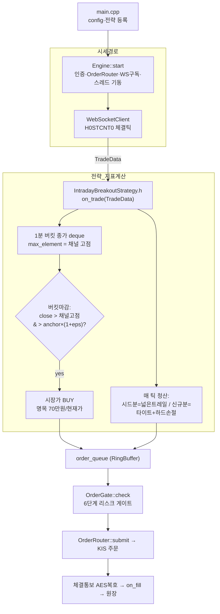

# 장중 매매 실증 — 백테스팅 코드 흐름도

이 저장소에는 **성격이 다른 두 검증 트랙**이 공존합니다. 흐름도를 볼 때 이 둘을 섞지 않는 것이 핵심입니다.

| 트랙 | 언어 | 성격 | 검증 방식 |
|---|---|---|---|
| **A. PYQuant 백테스트** | Python | 일봉 기반 횡단면 모멘텀 | 과거 데이터 시뮬레이션(진짜 백테스트) |
| **B. Quant 라이브 엔진 (ITB)** | C++ | 장중 채널돌파(intraday) | **백테스트 불가** → forward 관찰만 |

> 장중(intraday) 전략인 ITB는 무료 과거 수급/거래대금순위 경로가 없어 백테스트가 불가능합니다. 그래서 "실증"은 A(과거 시뮬)와 B(라이브 관찰)로 나뉩니다.

---

## 트랙 A — PYQuant 백테스트 파이프라인

### 파일별 역할 · 링크

| 단계 | 파일 | 역할 | 핵심 심볼 |
|---|---|---|---|
| 진입점 | [PYQuant/main.py](PYQuant/main.py) | CLI·소스/전략/유니버스 조립 | `cmd_backtest`, `make_source`, `select_universe`, `run_backtest` |
| 데이터소스 | [PYQuant/data/datagokr_source.py](PYQuant/data/datagokr_source.py) | point-in-time 데이터(권장) | `get_historical_ohlcv`, `prefetch_ohlcv`, `universe_top`, `_adjust_splits` |
| 데이터소스(대체) | [PYQuant/data/krx_source.py](PYQuant/data/krx_source.py) · [PYQuant/data/index_source.py](PYQuant/data/index_source.py) | KRX / 지수(레짐용) 소스 | 동일 덕타이핑 계약 |
| 백테스트 코어 | [PYQuant/backtest/engine.py](PYQuant/backtest/engine.py) | 수집·시뮬·체결·평가 | `run`, `_execute`, `_rebalance_to_target`, `_AsOfKisAdapter`, `market_risk_on`, `_vol_exposure`, `_calc_result` |
| 지표(모멘텀) | [PYQuant/strategy/cross_momentum.py](PYQuant/strategy/cross_momentum.py) | 채택 전략: 6-1 횡단면 모멘텀 | `on_rebalance` |
| 지표(공통) | [PYQuant/strategy/indicators.py](PYQuant/strategy/indicators.py) | SMA/정배열/이격도 (strategy_a 전용) | `sma`, `is_aligned`, `deviation_from_sma` |
| 전략 인터페이스 | [PYQuant/strategy/base.py](PYQuant/strategy/base.py) | 추상 베이스 | `StrategyBase`, `Position` |
| 리포트 | [PYQuant/backtest/report.py](PYQuant/backtest/report.py) | 콘솔 표 + CSV export | `print_report`, `export_daily_csv`, `export_trades_csv`, `export_holdings_csv` |
| 타입 정의 | [PYQuant/kis/client.py](PYQuant/kis/client.py) | `Bar`, `OrderSignal` 공용 타입 | — |
| 실행 원장 | [BACKTEST_LOG.md](BACKTEST_LOG.md) | 실행#1~#4 규칙변경·지표델타 | — |

### look-ahead(미래참조) 차단 3중 장치 — 흐름도 강조 포인트
1. `_AsOfKisAdapter` — `on_start` 스크리닝에 start_date 이전 봉만 노출
2. 일자 루프에서 `visible`을 `date`까지만 슬라이스 (수급은 `date` 미만)
3. 체결은 항상 `_peek_next_open` (다음봉 시가)

---

## 트랙 B — Quant C++ 라이브 엔진 (장중 ITB)

과거 시뮬이 아니라 **실시간 틱을 받아 forward 관찰**합니다. 지표(채널 고점)는 전략 헤더 내부에서 틱 단위로 계산합니다.

### 파일별 역할 · 링크

| 항목 | 파일 | 역할 | 핵심 심볼 |
|---|---|---|---|
| 장중 전략(신규) | [Quant/include/strategy/IntradayBreakoutStrategy.h](Quant/include/strategy/IntradayBreakoutStrategy.h) | 채널돌파 + 시드/신규 분리청산 | `on_trade`, `anchor_px_`, `closes_`, `position_is_seed_` |
| 전략 베이스 | [Quant/include/strategy/StrategyBase.h](Quant/include/strategy/StrategyBase.h) | C++ 추상 전략 | `on_trade`, `get_watch_specs`, `is_active` |
| 원형 전략 | [Quant/include/strategy/MACrossStrategy.h](Quant/include/strategy/MACrossStrategy.h) | 보유분 시드 패턴 참조 | `on_data`, `start_in_position_` |
| 확정 스펙 | [ITB_V2_SPEC.md](ITB_V2_SPEC.md) | 파라미터·안전장치 협의체 결론 | §0~§6 |
| 라이브 경로 추적 | [PIPELINE_A_to_Z.md](../docs/guides/PIPELINE_A_to_Z.md) | TRADE 모드 파일:라인 흐름 + 빈틈목록 | §13 G1/G2/G3 |
| 리스크 게이트 | [Quant/src/risk/OrderGate.cpp](Quant/src/risk/OrderGate.cpp) | 6단계 주문 검증 | `check` |
| 엔진 | [Quant/src/core/Engine.cpp](Quant/src/core/Engine.cpp) | 스레드 파이프라인 | `start` |

### ITB가 `on_trade`(WS 체결틱) 기반인 이유
[PIPELINE_A_to_Z.md](../docs/guides/PIPELINE_A_to_Z.md) §13의 빈틈 **G1**(`get_daily_ohlcv` 날짜 하드코딩 → 모의서버 500 → 일봉 신호 0건)·**G2**(count=1 폴링 반복)을 우회하기 위해, REST 일봉 대신 WS 체결틱을 직접 소비하도록 설계됨.

---

## 두 트랙의 연결 고리

- **신호 패리티**: [engine.py](PYQuant/backtest/engine.py)의 `market_risk_on`·`equal_weight_qty`는 "백테스트·라이브 공유"로 명시 → 백테스트에서 검증한 규칙을 [PYQuant/live/forward_trader.py](PYQuant/live/forward_trader.py)가 KIS 모의계좌로 재현.
- **ITB는 별개 트랙**: 백테스트 불가 전략이므로, PYQuant 백테스트 루프와 분리해 `C++ 라이브 엔진 → forward 관찰 → BACKTEST_LOG/ITB_V2_SPEC 수기 기록` 형태로 검증.
